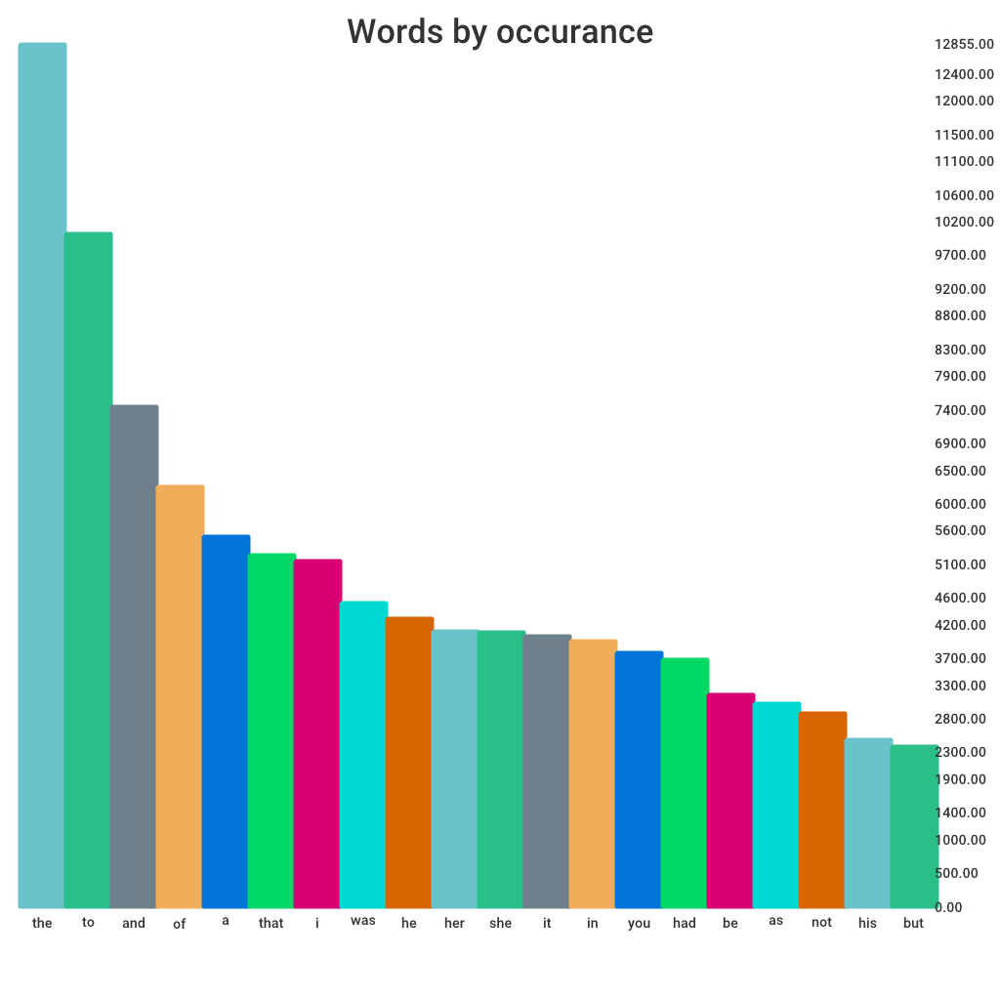

# zipf-law

A simple program to display zipf law with a graph.

See this amazing video from vsauce which inspired this mini project.

[VSauce Zipf Mystery](https://www.youtube.com/watch?v=fCn8zs912OE&t=16s)

The books are available thanks to [textfiles.com](https://textfiles.com/)

Of the books that I have in the `txtfiles` folder below is the results:

